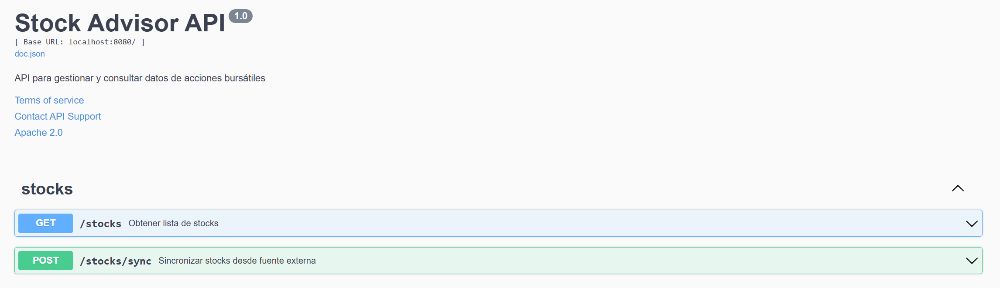

# Stock Advisor Backend

Stock Advisor Backend is a robust Go-based API for managing and querying stock market data, designed with clean architecture and hexagonal architecture principles.



## Features

- **RESTful API** for stock market data retrieval
- **Advanced Filtering**: Search and filter stocks by multiple criteria
- **Intelligent Recommendation Algorithm**: Score stocks based on target prices and ratings
- **Data Synchronization**: Sync stocks from external data sources
- **Database Agnostic**: Designed with GORM for flexible database support
- **Comprehensive Swagger Documentation**
- **Dependency Injection** using Uber FX
- **CORS Support**

## Technologies

- **Go 1.23+**
- **Echo Framework**
- **GORM**
- **PostgreSQL**
- **Uber FX**
- **Swagger**
- **Testify**

## Requirements

- Go 1.23 or higher
- PostgreSQL
- External Stock Data API (configured in `.env`)

## Installation

1. Clone the repository:
```bash
git clone https://github.com/julianloaiza/stock-advisor-backend.git
cd stock-advisor-backend
```

2. Install dependencies:
```bash
go mod download
```

3. Create and configure `.env` file:
```bash
cp .env.example .env
# Edit .env with your configuration
```

4. Generate Swagger documentation:
```bash
swag init
```

## Configuration

Configure the following in `.env`:
- `DATABASE_URL`: PostgreSQL connection string
- `STOCK_API_URL`: External stock data API URL
- `STOCK_AUTH_TKN`: API authentication key
- `SYNC_MAX_ITERATIONS`: Maximum sync iterations
- `SYNC_TIMEOUT`: Sync operation timeout
- `CORS_ALLOWED_ORIGINS`: Allowed CORS origins

## Running the Application

```bash
# Run the application
go run main.go
```

## Testing

```bash
# Run all tests
go test ./...

# Generate coverage report
go test ./... -coverprofile=coverage.out
go tool cover -html=coverage.out
```

## API Documentation

Access Swagger documentation at:
`http://localhost:8080/swagger/index.html`

## Project Structure

```
└── 📁stock-advisor
    ├── 📁config               # Application configuration management
        └── config.go          # Loads and validates application configuration
    ├── 📁database             # Database connection setup
        └── database.go        # Establishes and manages database connection
    ├── 📁docs                 # Swagger documentation
        ├── docs.go            # Generated Swagger documentation
        ├── swagger.json       # Swagger JSON specification
        └── swagger.yaml       # Swagger YAML specification
    ├── 📁internal             # Core application logic
        ├── 📁domain           # Domain models and core entities
            └── stock.go       # Stock entity definition
        ├── 📁httpapi          # HTTP API layer
            ├── 📁handlers     # HTTP request handlers
                ├── handlers.go         # Base handler interface
                ├── 📁response          # API response utilities
                    └── response.go     # Standard API response structures
                └── 📁stocks            # Stock-specific handlers
                    ├── get.go          # GET stocks handler
                    ├── get_test.go     # Tests for GET stocks handler
                    ├── stocks.go       # Configuration and construction of stocks handlers module
                    ├── sync.go         # Stock synchronization handler
                    └── sync_test.go    # Tests for sync handler
            ├── httpapi.go             # HTTP API module configuration
            └── 📁middleware           # HTTP middleware
                └── cors.go            # CORS configuration
        ├── 📁repositories     # Data access layer
            ├── repositories.go        # Repository module configuration
            └── 📁stocks       # Stock-specific repositories
                ├── get.go             # Stock retrieval repository methods
                ├── get_test.go        # Tests for stock retrieval
                ├── stocks.go          # Configuration and construction of stocks repositories module
                ├── sync.go            # Stock synchronization repository methods
                └── sync_test.go       # Tests for sync repository methods
        └── 📁services         # Business logic layer
            ├── services.go            # Services module configuration
            └── 📁stocks       # Stock-specific services
                ├── get.go             # Stock retrieval service logic
                ├── get_test.go        # Tests for stock retrieval service
                ├── recommendation.go  # Stock recommendation algorithm
                ├── recommendation_test.go # Tests for recommendation algorithm
                ├── stocks.go          # Configuration and construction of stocks services module
                ├── sync.go            # Stock synchronization service logic
                └── sync_test.go       # Tests for sync service
    ├── .env                   # Environment configuration (local)
    ├── .env.example           # Example environment configuration
    ├── .gitignore             # Git ignore file
    ├── Dockerfile             # Docker container configuration
    ├── go.mod                 # Go module dependencies
    ├── go.sum                 # Exact dependency versions
    └── main.go                # Application entry point
```

## API Endpoints

- `GET /stocks`: Retrieve stocks with advanced filtering
- `POST /stocks/sync`: Synchronize stocks from external source
- `GET /swagger/*`: Swagger documentation

### GET /stocks Endpoint

#### Input Parameters (Query Params)
- `query` (optional): General search text
  - Searches in: ticker, company, brokerage, action, ratings
- `page` (optional): Page number 
  - Default value: 1
- `size` (optional): Number of records per page
  - Default value: 10
- `recommends` (optional): Order by recommendation score
  - Values: `true` or `false`
  - Default value: `false`
- `minTargetTo` (optional): Minimum target price
- `maxTargetTo` (optional): Maximum target price
- `currency` (optional): Price currency
  - Default value: "USD"

#### Example Request
```
GET /stocks?query=AAPL&page=1&size=10&recommends=true&minTargetTo=150&maxTargetTo=200&currency=USD
```

#### Successful Response (200 OK)
```json
{
  "code": 200,
  "data": {
    "content": [
      {
        "id": 1054506709730689025,
        "ticker": "AAPL",
        "company": "Apple Inc.",
        "brokerage": "Goldman Sachs",
        "action": "upgraded by",
        "rating_from": "Hold",
        "rating_to": "Buy", 
        "target_from": 150,
        "target_to": 180,
        "currency": "USD",
        "time": "2025-02-26T19:30:06.366255-05:00"
      }
    ],
    "total": 1000,
    "page": 1,
    "size": 10
  },
  "message": "Stock query successful"
}
```

### POST /stocks/sync Endpoint

#### Input Parameters
```json
{
  "limit": 5  // Number of sync iterations
}
```

#### Constraints
- `limit` must be a positive integer
- Default value: 1
- Maximum configurable in server settings (default: 100)

#### Example Request
```json
{
  "limit": 5
}
```

#### Successful Response (200 OK)
```json
{
  "code": 200,
  "message": "Synchronization completed successfully"
}
```

#### Possible Errors
- 400 Bad Request: 
  - Invalid limit
  - Error reading request body
- 500 Internal Server Error: 
  - Error during synchronization with external API

#### Important Notes
- Each iteration updates approximately 10 stock records
- Synchronization COMPLETELY replaces existing data
- The operation cannot be undone once completed